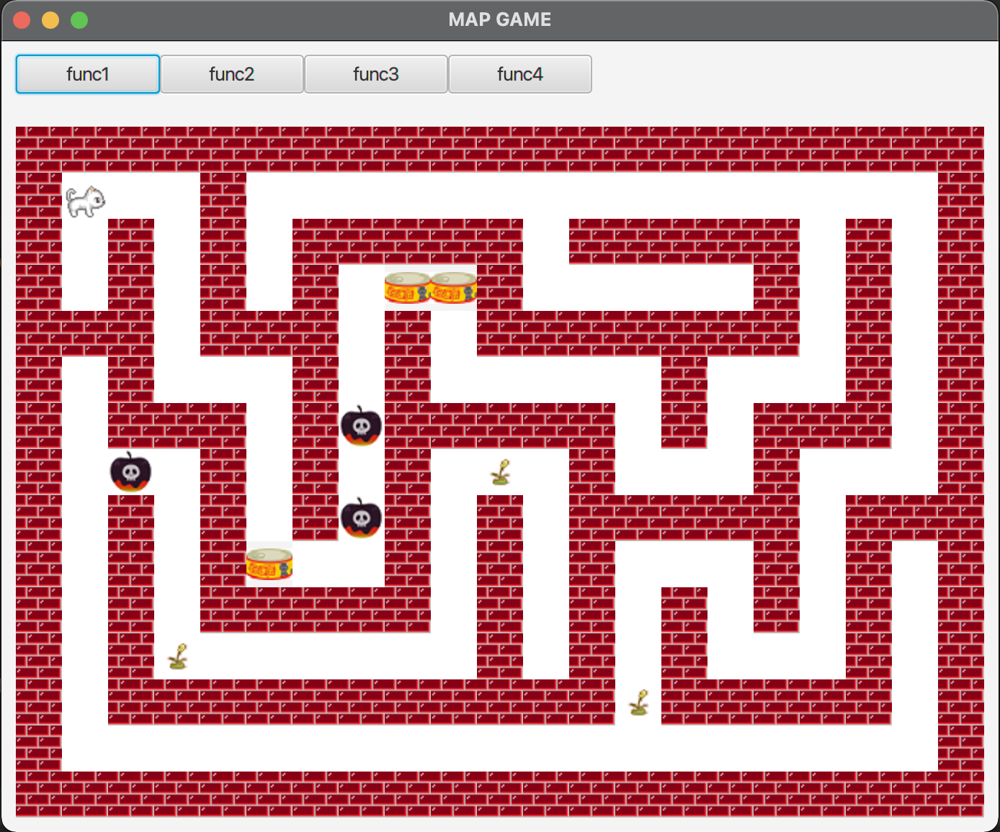

# Programing 2020 Map-Game Project



## Remarks
To run this project, import to IntelliJ IDE (Running manually is also fine as well)  
To run directly from terminal:
```shell
$ cd src

$ javac --module-path $PATH_TO_MODULE --add-modules javafx.controls,javafx.fxml,javafx.media *.*/java *.java

$ java --module-path $PATH_TO_MODULE --add-modules javafx.controls,javafx.fxml,javafx.media mapgame.MapGame
```

## Progress
- [x] Required Feature 1: Item -> Item has no effects yet
- [x] Required Feature 2: Goal -> Static position for now
- [x] Required Feature 3: Map Clear -> Completed
- [ ] Required Feature 4: Score
- [ ] Required Feature 5: BGM
- [ ] Extra Feature 1: Settings Menu
- [ ] Extra Feature 2:

## Changes & Features
- Changes are documented in [changes.md](changes.md)
- Features are documented in [features.md](features.md)